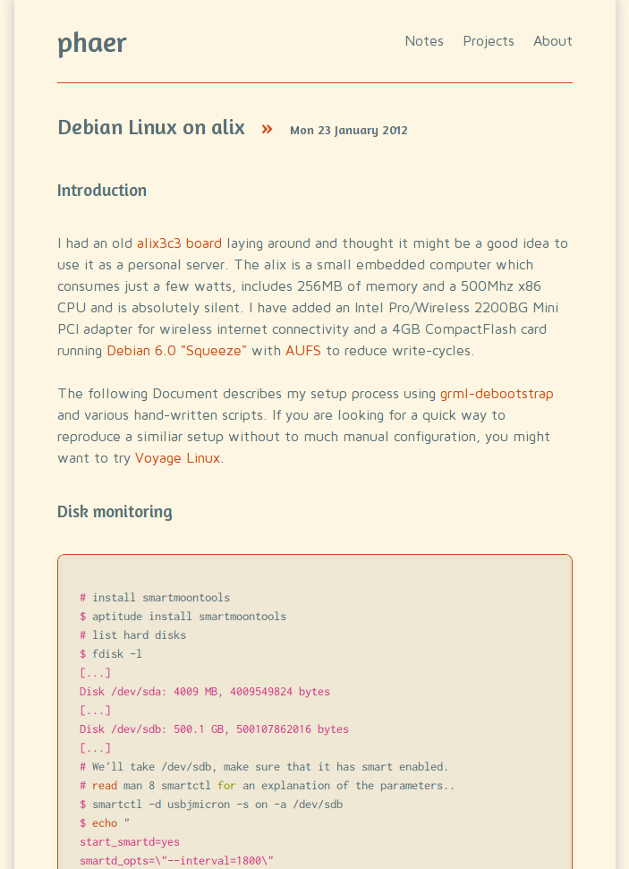
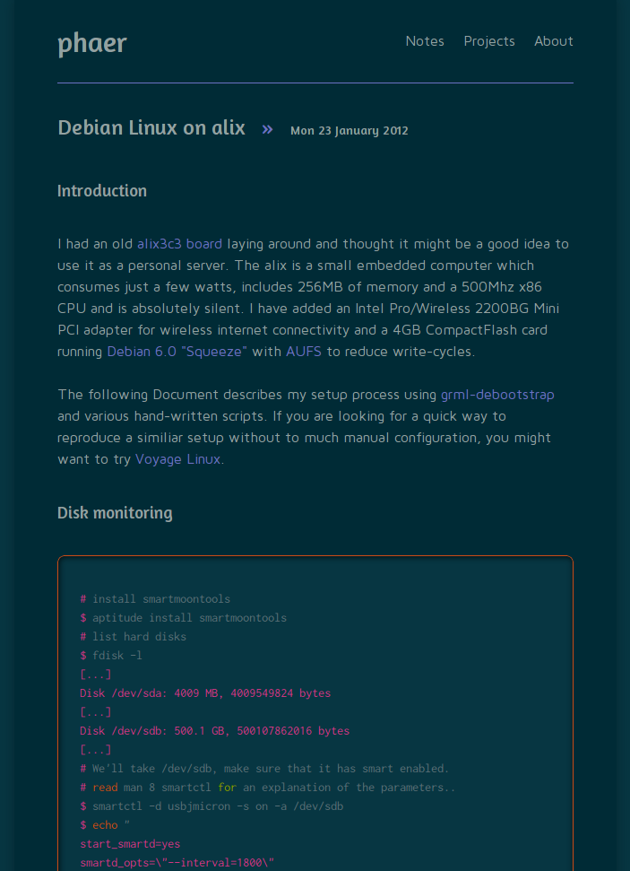

# Solarized for Pelican

...is a minimal theme for [pelican][pelican], a static site generator, based on the [solarized][solarized] color scheme.

It includes two variants (light and dark), both of which are currently under development. If you would like to contribute: do it!

## Screenshots

## Todos
approximately ordered by priority.

* Feeds
* Write missing templates
* Mobile variant (media queries)
* Validate
* Replace Google Webfonts with fonts in ./static to reduce external dependencies.
* Make it easier to set the dark variant as default theme.
* Improve metadata, semantics

[pelican]: http://pelican.notmyidea.org/
[solarized]: http://pelican.notmyidea.org/
